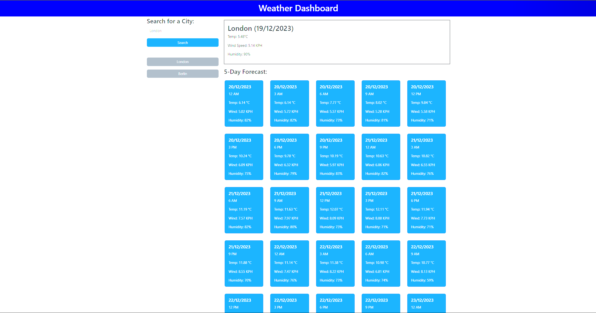

# weather-dashboard

An app that allows users to see the weather forecast for cities of their choosing.

## Description

A web app written in javascript, HTML and CSS that displays today's weather and a 5-day forecast (showing every 3 hours) for a city of the user's choice.

A link to the application can be found here:

## Installation

THe project is a static webpage hosted on Github Pages so no installation is required apart from a web browser of your choice.

## Usage

Enter the city you wish to see in the search bar and click 'search'. Previous searches will be saved as a grey button on the left hand side, and can be clicked again to show the weather.

## Credits

https://day.js.org/docs/en/display/format was used to understand how to format the dates and hours.

## License

MIT License

Copyright (c) 2023 Thomas Fahy

Permission is hereby granted, free of charge, to any person obtaining a copy
of this software and associated documentation files (the "Software"), to deal
in the Software without restriction, including without limitation the rights
to use, copy, modify, merge, publish, distribute, sublicense, and/or sell
copies of the Software, and to permit persons to whom the Software is
furnished to do so, subject to the following conditions:

The above copyright notice and this permission notice shall be included in all
copies or substantial portions of the Software.

THE SOFTWARE IS PROVIDED "AS IS", WITHOUT WARRANTY OF ANY KIND, EXPRESS OR
IMPLIED, INCLUDING BUT NOT LIMITED TO THE WARRANTIES OF MERCHANTABILITY,
FITNESS FOR A PARTICULAR PURPOSE AND NONINFRINGEMENT. IN NO EVENT SHALL THE
AUTHORS OR COPYRIGHT HOLDERS BE LIABLE FOR ANY CLAIM, DAMAGES OR OTHER
LIABILITY, WHETHER IN AN ACTION OF CONTRACT, TORT OR OTHERWISE, ARISING FROM,
OUT OF OR IN CONNECTION WITH THE SOFTWARE OR THE USE OR OTHER DEALINGS IN THE
SOFTWARE.
